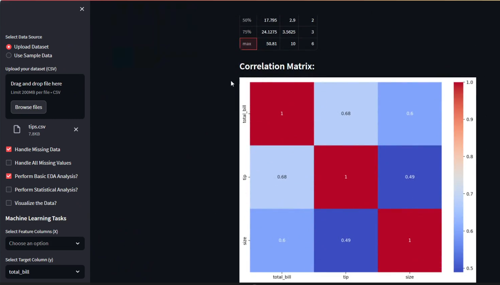

# **🚀Introducing my newest product, an Enhanced Exploratory Data Analysis (EDA) and Machine Learning Toolkit, with great pleasure!  🚀**

🌟 This powerful Streamlit application is designed to take you from raw data to precise predictions with ease. Whether you're dealing with missing data, performing EDA, or diving into advanced machine-learning tasks, this app has got you covered!

**Key Features:**

📂 **Data Handling:** Seamlessly upload your datasets or use sample data for quick analysis.

🛠️ **Missing Data Handling:** Fill missing values with mean, median, or mode, or handle all missing values simultaneously.

📊 **EDA Capabilities:** Perform basic EDA, visualize data with various plot types, and generate detailed statistical analyses.

📉 **Statistical Analysis:** Conduct hypothesis testing, calculate skewness and kurtosis, and perform t-tests and chi-square tests for a deeper understanding of your data.

🧮 **Machine Learning:** Choose from a wide range of regression and classification models, with automatic encoding and scaling.

📉 **Model Evaluation:** Get comprehensive metrics, download trained models, and identify the best and worst performing models.

This app is a must-have for anyone looking to streamline their data analysis and machine learning workflows. Check out the snapshots below to see its practical functionality in action!

🔗 See the **Snapshots** below to witness the app's practical functionality in action!

## Snapshot of the  TOSIEF's EDA-ML Toolkit backend code in an IDE, showing the Python script responsible for EDA

## **Initial Setup of TOSIEF's EDA-ML Toolkit**
### **A snapshot of the web application interface featuring an option to load sample data. The interface showcases a sidebar with various data handling capabilities such as 'Handle Missing Data' and 'Perform Basic EDA Analysis?'. The main panel displays the 'Sample Data Loaded!' notification above a table summarizing the dataset overview, including fields like total bill, tip, sex, and smoker status.**

## Handling Missing Data Interface in EDA-ML Toolkit
### **This image shows the application's functionality for handling missing data. A 'Handle Missing Data' section is visible where users can select methods to impute missing values, such as filling the 'embark_town' with the mode value. Below this section, the resulting data frame with missing values handled is displayed.**

## Correlation Matrix Visualization
### **The application's interface displaying a correlation matrix for various numerical dataset features such as 'total_bill', 'tip', and 'size'. The matrix uses a color gradient from blue to red to signify correlation strengths, assisting in exploratory data analysis.**

## Summary Statistics Feature
### **Detailed summary statistics of a dataset are displayed, including count, mean, standard deviation, min, max, and quartiles for features like 'total_bill', 'tip', and 'size'. Additional statistical measures such as skewness and kurtosis are also provided.**

## Statistical Analysis Options
### **This part of the interface allows users to perform statistical analysis, showing options for selecting variables and statistical tests, such as the Chi-square test for independence. Results include a Chi2 statistic, P-value, and an expected frequency table.**

## Histogram Visualization in Data Analysis
### **Displaying a histogram of 'total_bill' within the data visualization section of the application, including interactive options to download the plot in various formats.

## Scatter Plot Visualization
### **The interface showcases a scatter plot relating 'tip' and 'total_bill', highlighting the distribution of tips with respect to total bills. The plot is interactive, allowing users to download it in different formats.**

## Regression Analysis and Model Comparison
### **The application presents regression analysis results, including metrics like Mean Squared Error, R2 Score, and Root Mean Square Error for models like Linear Regression, Support Vector Regression, and Random Forest Regressor.**

## Classification Model Evaluation
### **Metrics and downloadable model options for Logistic Regression, Gradient Boosting Classifier, and Decision Tree Classifier are displayed, with evaluation metrics such as Accuracy, F1-Score, Precision, and Recall.**

## Best and Worst Classification Model Display
### **The application compares various classification models, highlighting the best and worst based on their accuracy and F1-score, providing a clear comparative analysis to guide user decision-making.**

